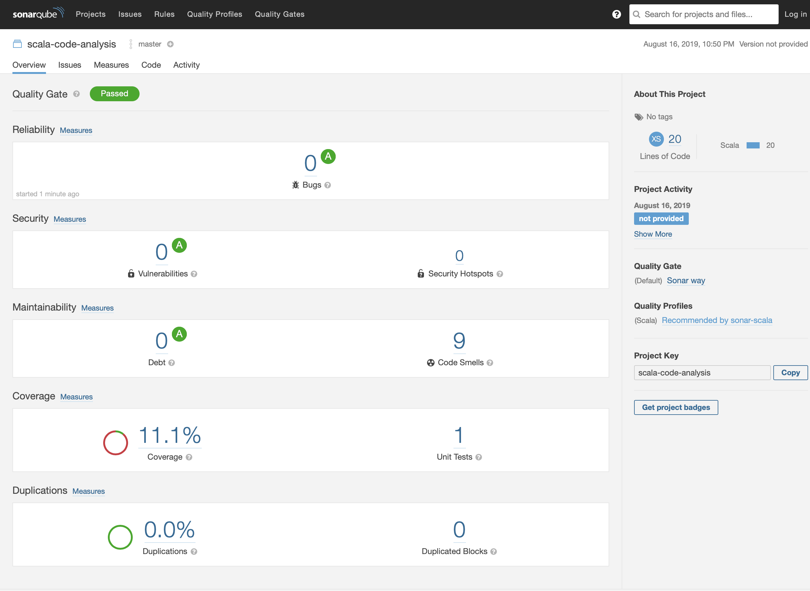

# Sample Scala Application with static code analysis setup 
Sample Scala application with SonarQube integrated for code analysis

#### Pre-Requisite
* Install Scala
* Install SBT
* Install Docker
* Setup SonarQube or make use of SonarCloud
* Setup Jenkins

### Best Practices
* Use proper naming convention
* Create unit test cases as part of your development
* Use code scanning tools for static code analysis, code vulnerability checks (For Ex. SonarQube, Fortify)
* Follow git branching strategy and allow merge to master branch through PRs with code review done

### About sample application
A very simple app with a method which sums up 2 input parameters and the other which has bad code pattern to be reported by Sonarqube scanner

#### Building project
```
sbt compile
```
#### Running Unit Tests
```
sbt test
```
#### Running project
```
sbt run
```
#### Running SonarQube scanner
```
sbt sonarScan
```
Sonarqube configurations are provided within build.sbt file which can be altered based on your docker-machine IP or Sonarqube instance IP

## Setting up Jenkins & SonarQube

For easy use case, we could setup Jenkins & Sonarqube using Docker and its been simplified with docker-compose.

Use below commands to create docker containers 

```
docker-compose -f docker-compose.yml up --build
```

To run in daemon mode, use the below command

```
docker-compose up -d
```

After Jenkins and Sonarqube has been setup with Docker containers, you should be able to access them from browser. 
If it's hosted using docker-machine, then you need to access using its IP Address

<b><u>Jenkins</u></b>

http://localhost:8080

or

http://{DOCKER-ENGINE-IPADDRESS}:8080


<b><u>Sonarqube</u></b>

http://localhost:9000

or

http://{DOCKER-ENGINE-IPADDRESS}:9000


## Jenkins Pipeline
Pipeline job can be setup to build, unit test, code scan with Sonarqube on every code push with Webhooks setup.

Once your Jenkins is up and running, install the default plugins that are recommended. Also ensure the below pre-requisites are installed,

* Git
* Sbt plugin

#### Jenkins job setup
* Create a new job/item
    * Give it a name (“scala-sampleApp-build”)
    * Choose Pipeline
    * Click Ok
* Next screen
    * Fill in the Description (whatever you want)
* Under Pipeline:
    * Choose “Pipeline script from SCM”
    * SCM = Git
    * Repo URL: Provide path of Git repo and the JenkinsFile location
* Save
* Click “Build now”

Refer to this below screenshot for job config


Jenkins job output view,


SonarQube Metrics Report
